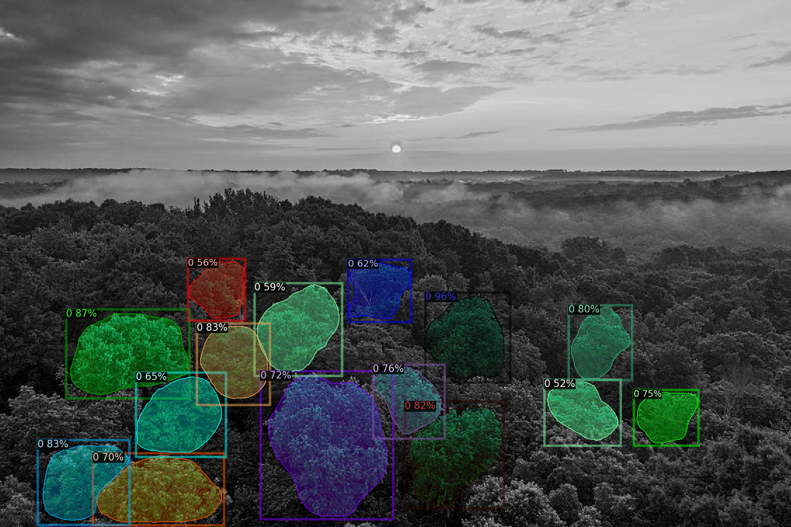

# Advanced Tree Identification with Object Detection

## Overview

This project presents an advanced object detection system designed for tree identification. We leverage pretrained Convolutional Neural Network (CNN) models, including Dectectron2 and YOLOv8, to accurately detect and identify trees in images. This process involves retraining these models using customized training datasets that include bounding boxes for precise tree identification.

## Features

- Utilizes state-of-the-art object detection models: Dectectron2 and YOLOv8.
- Customized training datasets with labeled bounding boxes for tree identification.
- Accurate and efficient tree detection in images.
- Scalable for various tree species and environmental conditions.

## Results 

- Dectectron2

- YOLOv8

[

Our object detection system for tree identification delivers exceptional accuracy and precise localization. This makes it a valuable asset for environmental monitoring, forestry management, and biodiversity research.

